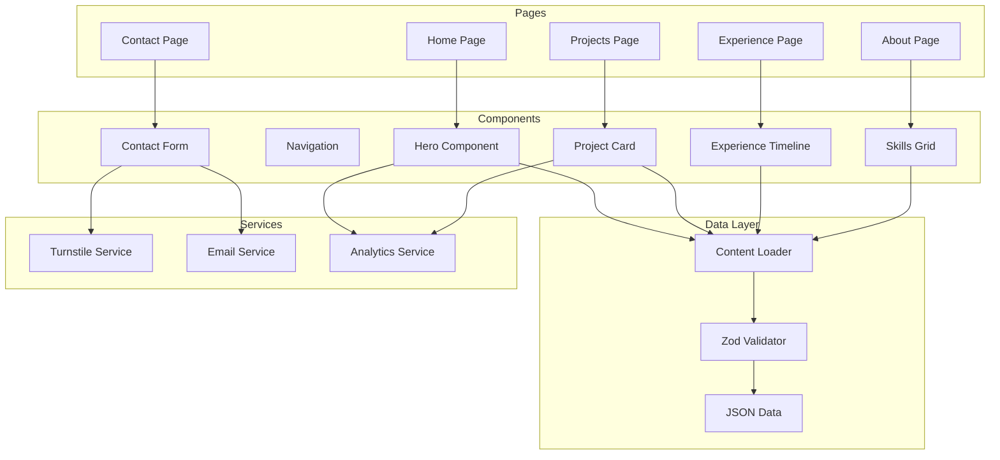
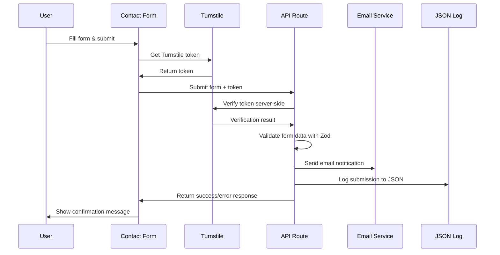
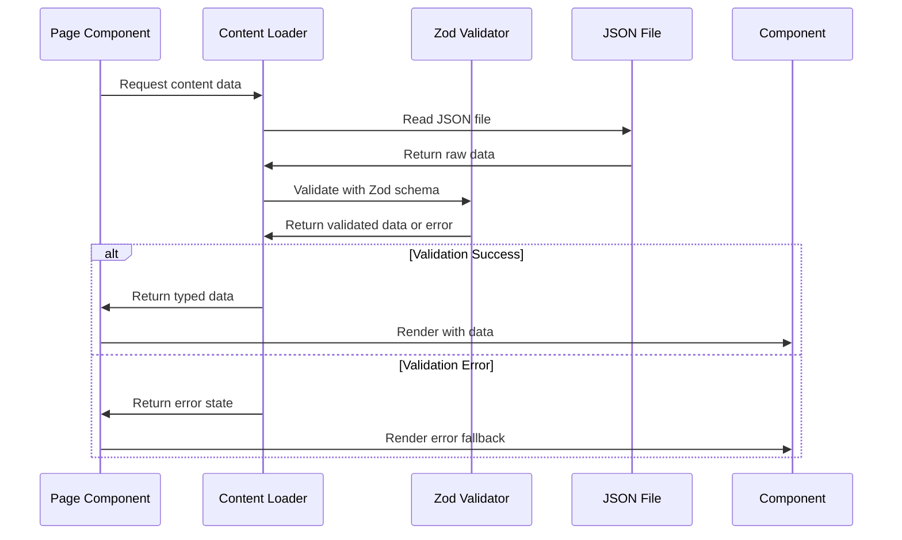

# Zishan Jawed Portfolio Website - Architecture Document

## Introduction

This document outlines the complete architecture for Zishan Jawed's portfolio website, designed as a modern, performant, and accessible showcase of his senior backend engineering expertise in fintech and payments. The architecture prioritizes performance, accessibility, and maintainability while demonstrating technical excellence through modern development practices.

**Relationship to Frontend Architecture:**
This is a fullstack architecture document that covers both frontend and backend concerns in a unified approach, optimized for the specific requirements of a portfolio website deployed on Cloudflare Workers via OpenNext.

### Document Scope
Comprehensive documentation of the entire system architecture, focusing on Next.js App Router deployment on Cloudflare Workers, data-driven content management, and performance optimization.

### Change Log

| Date | Version | Description | Author |
|------|---------|-------------|--------|
| 2025-01-XX | 1.0 | Initial architecture creation | Architect |

## High Level Architecture

### Technical Summary

The portfolio website is built as a modern Next.js application using the App Router with TypeScript, deployed on Cloudflare Workers via OpenNext for optimal performance and global distribution. The architecture follows a data-driven approach where all content is stored in structured JSON files with Zod validation, enabling easy content updates without code changes. The system implements comprehensive SEO optimization through Next.js Metadata API and JSON-LD structured data, while maintaining exceptional performance standards (LCP < 2.5s, CLS < 0.1, initial JS < 200KB) and full accessibility compliance.

### High Level Overview

**Architectural Style**: Jamstack with Serverless Edge Functions
- Static site generation with dynamic API routes for contact form handling
- Content served from JSON files with server-side validation
- Edge functions for contact form processing and dynamic OG image generation

**Repository Structure**: Monorepo
- Single repository containing all frontend code, content data, and configuration
- Clear separation between content (/data), components (/components), and utilities (/lib)
- Shared TypeScript types and Zod schemas for type safety

**Service Architecture**: Monolith with Edge Functions
- Next.js application as the primary service
- Cloudflare Pages Functions for API routes
- No complex backend services required

**Primary User Interaction Flow**:
1. User visits portfolio homepage
2. Content loaded from JSON files with Zod validation
3. Static pages served with optimized assets
4. Contact form submissions processed via edge functions
5. SEO metadata and structured data generated dynamically

### High Level Project Diagram

```mermaid
graph TB
    subgraph "User"
        U[Visitor]
    end
    
    subgraph "CDN & Edge"
        CDN[Cloudflare CDN]
        EDGE[Edge Functions]
    end
    
    subgraph "Application"
        NEXT[Next.js App Router]
        PAGES[Static Pages]
        API[API Routes]
    end
    
    subgraph "Content Layer"
        JSON[/data/*.json]
        ZOD[Zod Schemas]
        TYPES[TypeScript Types]
    end
    
    subgraph "External Services"
        TURNSTILE[Cloudflare Turnstile]
        ANALYTICS[Cloudflare Analytics]
        EMAIL[Email Service]
    end
    
    U --> CDN
    CDN --> EDGE
    EDGE --> NEXT
    NEXT --> PAGES
    NEXT --> API
    PAGES --> JSON
    API --> JSON
    JSON --> ZOD
    ZOD --> TYPES
    API --> TURNSTILE
    API --> EMAIL
    PAGES --> ANALYTICS
```

### Architectural and Design Patterns

**Jamstack Architecture**: Static site generation with dynamic capabilities - *Rationale:* Optimal performance, security, and scalability for content-focused portfolio sites

**Data-Driven Content Management**: JSON files with Zod validation - *Rationale:* Enables easy content updates without code changes, maintains type safety, and separates content from presentation

**Component-Based UI**: Reusable React components with TypeScript - *Rationale:* Maintainability, type safety, and consistent design system across the application

**Edge Computing**: Cloudflare Workers for API routes - *Rationale:* Global distribution, low latency, and cost-effective serverless execution

**Progressive Enhancement**: Core functionality works without JavaScript - *Rationale:* Accessibility, SEO, and graceful degradation for all users

## Tech Stack

### Cloud Infrastructure
- **Provider:** Cloudflare
- **Key Services:** Pages, Workers, Turnstile, Web Analytics, CDN
- **Deployment Regions:** Global edge network

### Technology Stack Table

| Category | Technology | Version | Purpose | Rationale |
|----------|------------|---------|---------|-----------|
| **Framework** | Next.js | 15.0.0 | React framework with App Router | Optimal for static sites with dynamic capabilities, excellent Cloudflare support |
| **Language** | TypeScript | 5.3.3 | Type-safe JavaScript | Prevents runtime errors, improves developer experience, better IDE support |
| **Runtime** | Node.js | 20.11.0 | JavaScript runtime | LTS version, stable performance, wide ecosystem support |
| **Styling** | Tailwind CSS | 4.0.0 | Utility-first CSS framework | Rapid development, consistent design system, excellent performance |
| **UI Components** | shadcn/ui | Latest | Component library | High-quality, accessible components built on Radix UI primitives |
| **Animation** | Framer Motion | 11.0.0 | Animation library | Excellent performance, reduced-motion support, React integration |
| **3D Graphics** | React Three Fiber | 8.15.0 | 3D rendering | Lightweight 3D capabilities with device-adaptive fallbacks |
| **Validation** | Zod | 3.22.0 | Schema validation | Type-safe validation, excellent TypeScript integration |
| **Deployment** | OpenNext | 3.0.0 | Cloudflare adapter | Optimized Next.js deployment on Cloudflare Workers |
| **Analytics** | Cloudflare Web Analytics | Latest | Visitor tracking | Privacy-focused, no cookies required, excellent performance |
| **Spam Protection** | Cloudflare Turnstile | Latest | Bot protection | Privacy-friendly alternative to reCAPTCHA, excellent UX |
| **Fonts** | Inter + JetBrains Mono | Latest | Typography | Professional, readable fonts optimized for web |
| **Build Tool** | Turbopack | Latest | Bundler | Faster builds, better development experience |
| **Testing** | Vitest | 1.0.0 | Unit testing | Fast, modern testing framework with excellent TypeScript support |
| **E2E Testing** | Playwright | 1.40.0 | End-to-end testing | Cross-browser testing, excellent performance testing capabilities |
| **Performance** | Lighthouse CI | Latest | Performance monitoring | Automated performance testing and budget enforcement |

## Data Models

### Person Model
**Purpose:** Core profile information for Zishan Jawed

**Key Attributes:**
- `name`: string - Full name for display
- `title`: string - Professional title/headline
- `location`: string - Current location and timezone
- `email`: string - Primary contact email
- `summary`: string - Professional summary (200-250 words)
- `elevatorPitch`: string - Brief value proposition (75 words)
- `skills`: Skill[] - Technical skills and expertise
- `social`: SocialLinks - Professional social media links
- `availability`: string - Current availability status

**Relationships:**
- Has many experiences (work history)
- Has many projects (portfolio items)
- Has many skills (technical expertise)

### Experience Model
**Purpose:** Work history and professional experience

**Key Attributes:**
- `company`: string - Company name
- `role`: string - Job title
- `startDate`: string - Start date (ISO format)
- `endDate`: string - End date or "Present"
- `location`: string - Work location
- `description`: string - Role description
- `achievements`: Achievement[] - Quantified achievements
- `technologies`: string[] - Tech stack used
- `impact`: string - One-sentence impact summary

**Relationships:**
- Belongs to person (Zishan)
- Has many achievements (STAR-style bullets)

### Project Model
**Purpose:** Portfolio projects and case studies

**Key Attributes:**
- `title`: string - Project name
- `description`: string - Project description
- `outcome`: string - Key outcomes and metrics
- `technologies`: string[] - Tech stack used
- `duration`: string - Project duration
- `client`: string - Client or company
- `links`: ProjectLinks - Live links and resources
- `metrics`: ProjectMetrics - Quantified results
- `caseStudy`: string - Detailed case study content

**Relationships:**
- Belongs to person (Zishan)
- May have multiple technologies
- May have external links and resources

### Skill Model
**Purpose:** Technical skills and expertise

**Key Attributes:**
- `name`: string - Skill name
- `category`: SkillCategory - Skill category (Backend, Frontend, Cloud, etc.)
- `level`: SkillLevel - Proficiency level (Expert, Advanced, Working)
- `years`: number - Years of experience
- `lastUsed`: string - Last used date
- `version`: string - Version/specification

**Relationships:**
- Belongs to person (Zishan)
- Categorized by domain

## Components

### Core Application Components

**App Router Structure**
- **Responsibility:** Next.js App Router with file-based routing
- **Key Interfaces:** Page components, layout components, loading states
- **Dependencies:** Next.js framework, TypeScript
- **Technology Stack:** Next.js 15, App Router, TypeScript

**Content Management System**
- **Responsibility:** Load and validate JSON content with Zod schemas
- **Key Interfaces:** Content loaders, validation functions, error handling
- **Dependencies:** Zod validation, TypeScript types
- **Technology Stack:** Zod, TypeScript, JSON file system

**UI Component Library**
- **Responsibility:** Reusable UI components with consistent design
- **Key Interfaces:** Component props, accessibility features, theming
- **Dependencies:** shadcn/ui, Tailwind CSS, Framer Motion
- **Technology Stack:** shadcn/ui, Radix UI, Tailwind CSS

**Contact Form System**
- **Responsibility:** Secure contact form with spam protection
- **Key Interfaces:** Form validation, Turnstile integration, email sending
- **Dependencies:** Cloudflare Turnstile, email service
- **Technology Stack:** Next.js API routes, Turnstile, Zod validation

**SEO and Analytics**
- **Responsibility:** Search engine optimization and visitor tracking
- **Key Interfaces:** Metadata API, structured data, analytics tracking
- **Dependencies:** Next.js Metadata API, Cloudflare Analytics
- **Technology Stack:** Next.js Metadata API, JSON-LD, Cloudflare Analytics

### Component Diagrams



## External APIs

### Cloudflare Turnstile API
- **Purpose:** Bot protection for contact form
- **Documentation:** https://developers.cloudflare.com/turnstile/
- **Base URL(s):** https://challenges.cloudflare.com/turnstile/v0/siteverify
- **Authentication:** Secret key in environment variables
- **Rate Limits:** 100 requests per minute per IP
- **Key Endpoints Used:**
  - `POST /siteverify` - Verify Turnstile token
- **Integration Notes:** Server-side verification required, token expires after 5 minutes

### Email Service API (Resend/Postmark)
- **Purpose:** Send contact form notifications
- **Documentation:** https://resend.com/docs or https://postmarkapp.com/developer
- **Base URL(s):** https://api.resend.com/emails or https://api.postmarkapp.com/email
- **Authentication:** API key in environment variables
- **Rate Limits:** 100 emails per day (free tier)
- **Key Endpoints Used:**
  - `POST /emails` - Send email notification
- **Integration Notes:** Choose based on deliverability needs, implement retry logic

## Core Workflows

### Contact Form Submission Flow



### Content Loading and Validation Flow



## REST API Spec

### Contact Form API

```yaml
openapi: 3.0.0
info:
  title: Zishan Portfolio Contact API
  version: 1.0.0
  description: API for handling contact form submissions with spam protection
servers:
  - url: https://zishan.loopcraftlab.com/api
    description: Production API
paths:
  /contact:
    post:
      summary: Submit contact form
      description: Submit a contact form with Turnstile verification
      requestBody:
        required: true
        content:
          application/json:
            schema:
              type: object
              required:
                - name
                - email
                - subject
                - message
                - turnstileToken
              properties:
                name:
                  type: string
                  minLength: 1
                  maxLength: 100
                email:
                  type: string
                  format: email
                subject:
                  type: string
                  minLength: 1
                  maxLength: 200
                message:
                  type: string
                  minLength: 1
                  maxLength: 2000
                turnstileToken:
                  type: string
      responses:
        '200':
          description: Contact form submitted successfully
          content:
            application/json:
              schema:
                type: object
                properties:
                  success:
                    type: boolean
                  message:
                    type: string
        '400':
          description: Invalid form data or Turnstile verification failed
        '429':
          description: Rate limit exceeded
        '500':
          description: Internal server error
```

## Database Schema

### JSON File Structure

Since this is a static site with JSON-based content management, the "database" consists of structured JSON files:

```json
// /data/person.json
{
  "name": "Zishan Jawed",
  "title": "Senior Backend & Full-Stack Engineer",
  "location": "India (Remote, IST / UTC+5:30)",
  "email": "dev.zishan@gmail.com",
  "summary": "I am a senior backend-heavy full-stack engineer...",
  "elevatorPitch": "I design and ship backend-heavy systems...",
  "social": {
    "github": "https://github.com/zishanjawed",
    "linkedin": "https://linkedin.com/in/zishan-jawed",
    "twitter": "https://twitter.com/DevZishan"
  },
  "availability": "Available for full-time and freelance opportunities"
}

// /data/experience.json
[
  {
    "id": "callphone",
    "company": "CallPhone Ltd.",
    "role": "Team Lead / Senior Backend Engineer",
    "startDate": "2023-03",
    "endDate": "Present",
    "location": "Remote (Nigeria/India)",
    "description": "Scaled and secured a payment aggregator...",
    "technologies": ["Python", "FastAPI", ".NET Core", "PostgreSQL"],
    "achievements": [
      {
        "situation": "Payment platform needed scale and strong uptime",
        "action": "Architected event-driven microservices...",
        "result": "₦5B+ monthly volume, sub-second latency, 99.9% uptime"
      }
    ]
  }
]

// /data/projects.json
[
  {
    "id": "airgate",
    "title": "Airgate Payment Aggregator",
    "description": "Scaled payment platform for CallPhone Ltd.",
    "outcome": "₦5B+ monthly transactions, 99.9% uptime, −30% cloud spend",
    "technologies": ["Python", "Next.js", "Terraform", "AWS"],
    "duration": "2023 - Present",
    "client": "CallPhone Ltd.",
    "metrics": {
      "monthlyVolume": "₦5B+",
      "uptime": "99.9%",
      "costReduction": "30%",
      "chargebackReduction": "22%"
    }
  }
]
```

## Source Tree

```
zishan-portfolio/
├── .github/                    # CI/CD workflows
│   └── workflows/
│       ├── ci.yml              # Continuous integration
│       └── deploy.yml          # Deployment pipeline
├── app/                        # Next.js App Router
│   ├── (site)/                 # Site pages group
│   │   ├── page.tsx            # Homepage
│   │   ├── about/              # About page
│   │   │   └── page.tsx
│   │   ├── experience/         # Experience page
│   │   │   └── page.tsx
│   │   ├── projects/           # Projects page
│   │   │   └── page.tsx
│   │   ├── skills/             # Skills page
│   │   │   └── page.tsx
│   │   └── contact/            # Contact page
│   │       └── page.tsx
│   ├── api/                    # API routes
│   │   └── contact/            # Contact form API
│   │       └── route.ts
│   ├── opengraph-image.tsx     # Dynamic OG image generation
│   ├── sitemap.ts              # Sitemap generation
│   ├── robots.ts               # Robots.txt generation
│   ├── layout.tsx              # Root layout
│   └── globals.css             # Global styles
├── components/                 # Reusable components
│   ├── ui/                     # shadcn/ui components
│   │   ├── button.tsx
│   │   ├── card.tsx
│   │   ├── input.tsx
│   │   └── ...
│   ├── layout/                 # Layout components
│   │   ├── header.tsx
│   │   ├── footer.tsx
│   │   └── navigation.tsx
│   ├── content/                # Content components
│   │   ├── hero.tsx
│   │   ├── project-card.tsx
│   │   ├── experience-timeline.tsx
│   │   └── skills-grid.tsx
│   ├── forms/                  # Form components
│   │   └── contact-form.tsx
│   └── 3d/                     # 3D components (optional)
│       ├── hero-scene.tsx
│       └── fallback.tsx
├── lib/                        # Utility functions
│   ├── content/                # Content loading utilities
│   │   ├── loaders.ts          # JSON content loaders
│   │   ├── search.ts           # Search functionality
│   │   └── validation.ts       # Content validation
│   ├── utils/                  # General utilities
│   │   ├── cn.ts               # Class name utility
│   │   ├── format-date.ts      # Date formatting
│   │   └── device-detection.ts # Device capability detection
│   └── constants/              # Application constants
│       └── site.ts
├── schemas/                    # Zod schemas
│   ├── person.ts               # Person schema
│   ├── experience.ts           # Experience schema
│   ├── projects.ts             # Projects schema
│   ├── skills.ts               # Skills schema
│   └── contact.ts              # Contact form schema
├── data/                       # Content data
│   ├── person.json             # Personal information
│   ├── experience.json         # Work experience
│   ├── projects.json           # Portfolio projects
│   ├── skills.json             # Technical skills
│   ├── writing.json            # Blog posts (future)
│   └── messages.json           # Contact form submissions log
├── public/                     # Static assets
│   ├── images/                 # Images and graphics
│   ├── icons/                  # Favicon and icons
│   └── fonts/                  # Custom fonts (if any)
├── styles/                     # Additional styles
│   └── components.css          # Component-specific styles
├── tools/                      # Development tools
│   ├── bmad/                   # BMAD method tools
│   │   ├── flattener.config.js # Codebase flattener config
│   │   └── team.json           # BMAD team configuration
│   └── ci/                     # CI/CD tools
│       ├── lighthouse.js       # Lighthouse CI configuration
│       └── performance.js      # Performance budget checks
├── types/                      # TypeScript type definitions
│   └── env-augment.d.ts        # Environment variable types
├── .env.example                # Environment variables template
├── .eslintrc.json              # ESLint configuration
├── .prettierrc                 # Prettier configuration
├── next.config.ts              # Next.js configuration
├── open-next.config.ts         # OpenNext configuration
├── package.json                # Dependencies and scripts
├── postcss.config.mjs          # PostCSS configuration
├── tailwind.config.ts          # Tailwind CSS configuration
├── tsconfig.json               # TypeScript configuration
├── wrangler.jsonc              # Cloudflare Workers configuration
└── README.md                   # Project documentation
```

## Infrastructure and Deployment

### Infrastructure as Code
- **Tool:** Cloudflare Pages (managed)
- **Location:** `wrangler.jsonc`
- **Approach:** Configuration-driven deployment with environment variables

### Deployment Strategy
- **Strategy:** Git-based deployment with automatic builds
- **CI/CD Platform:** GitHub Actions
- **Pipeline Configuration:** `.github/workflows/deploy.yml`

### Environments
- **Development:** Local development with `npm run dev`
- **Preview:** Automatic preview deployments for pull requests
- **Production:** Automatic deployment from main branch

### Environment Promotion Flow
```
Local Development → GitHub PR → Preview Deployment → Code Review → Merge to Main → Production Deployment
```

### Rollback Strategy
- **Primary Method:** Git revert and redeploy
- **Trigger Conditions:** Performance regression, critical bugs
- **Recovery Time Objective:** 5 minutes

## Error Handling Strategy

### General Approach
- **Error Model:** Structured error responses with appropriate HTTP status codes
- **Exception Hierarchy:** Custom error classes for different error types
- **Error Propagation:** Graceful degradation with user-friendly error messages

### Logging Standards
- **Library:** Built-in console logging with structured format
- **Format:** JSON structured logging for production
- **Levels:** Error, Warn, Info, Debug
- **Required Context:**
  - Request ID for correlation
  - User agent and IP for debugging
  - Error stack traces for development

### Error Handling Patterns

**External API Errors**
- **Retry Policy:** Exponential backoff for transient failures
- **Circuit Breaker:** Implement circuit breaker for external services
- **Timeout Configuration:** 5-second timeout for external API calls
- **Error Translation:** User-friendly error messages

**Business Logic Errors**
- **Custom Exceptions:** ValidationError, ContentError, ContactError
- **User-Facing Errors:** Clear, actionable error messages
- **Error Codes:** Structured error codes for debugging

**Data Consistency**
- **Transaction Strategy:** Atomic operations where possible
- **Compensation Logic:** Rollback mechanisms for failed operations
- **Idempotency:** Idempotent operations for retry safety

## Coding Standards

### Core Standards
- **Languages & Runtimes:** TypeScript 5.3.3, Node.js 20.11.0
- **Style & Linting:** ESLint with Next.js and TypeScript rules
- **Test Organization:** Vitest for unit tests, Playwright for E2E

### Naming Conventions
| Element | Convention | Example |
|---------|------------|---------|
| Components | PascalCase | `HeroSection.tsx` |
| Files | kebab-case | `project-card.tsx` |
| Functions | camelCase | `loadContentData` |
| Constants | UPPER_SNAKE_CASE | `MAX_FILE_SIZE` |
| Types | PascalCase | `ProjectData` |

### Critical Rules
- **Content Validation:** All JSON content must be validated with Zod schemas
- **Type Safety:** No `any` types allowed, use proper TypeScript types
- **Performance:** Lazy load heavy components (3D, animations)
- **Accessibility:** All interactive elements must be keyboard accessible
- **SEO:** Use Next.js Metadata API for all pages
- **Security:** Validate all form inputs server-side with Zod
- **Error Handling:** Provide user-friendly error messages with fallbacks

### Language-Specific Guidelines

**TypeScript Specifics**
- **Strict Mode:** Enable all strict TypeScript options
- **Type Imports:** Use type-only imports for types
- **Generic Constraints:** Use proper generic constraints
- **Error Types:** Define custom error types for different scenarios

## Test Strategy and Standards

### Testing Philosophy
- **Approach:** Test-driven development with comprehensive coverage
- **Coverage Goals:** 80% code coverage for critical paths
- **Test Pyramid:** 70% unit tests, 20% integration tests, 10% E2E tests

### Test Types and Organization

**Unit Tests**
- **Framework:** Vitest 1.0.0
- **File Convention:** `*.test.ts` or `*.spec.ts`
- **Location:** Co-located with source files
- **Mocking Library:** Vitest built-in mocking
- **Coverage Requirement:** 80% for business logic

**AI Agent Requirements:**
- Generate tests for all public functions and components
- Cover edge cases and error conditions
- Follow AAA pattern (Arrange, Act, Assert)
- Mock all external dependencies

**Integration Tests**
- **Scope:** API routes, content loading, form submission
- **Location:** `__tests__/integration/`
- **Test Infrastructure:**
  - **Content Loading:** Mock JSON files with test data
  - **API Routes:** Test with mock Turnstile responses
  - **Form Validation:** Test Zod schema validation

**End-to-End Tests**
- **Framework:** Playwright 1.40.0
- **Scope:** Critical user journeys (homepage, contact form, navigation)
- **Environment:** Headless browser testing
- **Test Data:** Fixture-based test data

### Test Data Management
- **Strategy:** Fixture-based approach with test-specific data
- **Fixtures:** `__tests__/fixtures/` directory
- **Factories:** Helper functions for generating test data
- **Cleanup:** Automatic cleanup after each test

### Continuous Testing
- **CI Integration:** Run tests on every pull request
- **Performance Tests:** Lighthouse CI with performance budgets
- **Security Tests:** Automated security scanning

## Security

### Input Validation
- **Validation Library:** Zod for all input validation
- **Validation Location:** API routes and content loaders
- **Required Rules:**
  - All external inputs MUST be validated
  - Validation at API boundary before processing
  - Whitelist approach preferred over blacklist

### Authentication & Authorization
- **Auth Method:** No user authentication required (public portfolio)
- **Session Management:** Not applicable
- **Required Patterns:**
  - Rate limiting on contact form
  - Turnstile verification for bot protection

### Secrets Management
- **Development:** `.env.local` for local development
- **Production:** Cloudflare Pages environment variables
- **Code Requirements:**
  - NEVER hardcode secrets
  - Access via environment variables only
  - No secrets in logs or error messages

### API Security
- **Rate Limiting:** 10 requests per minute per IP for contact form
- **CORS Policy:** Same-origin requests only
- **Security Headers:** Implement security headers via Cloudflare
- **HTTPS Enforcement:** HTTPS-only deployment

### Data Protection
- **Encryption at Rest:** Not applicable (static content)
- **Encryption in Transit:** HTTPS-only with HSTS
- **PII Handling:** Minimal PII collection (contact form only)
- **Logging Restrictions:** No sensitive data in logs

### Dependency Security
- **Scanning Tool:** npm audit and GitHub Dependabot
- **Update Policy:** Monthly dependency updates
- **Approval Process:** Automated security updates with manual review for major versions

### Security Testing
- **SAST Tool:** ESLint security rules
- **DAST Tool:** OWASP ZAP for security testing
- **Penetration Testing:** Annual security review

## Performance Budget

### Core Web Vitals Targets
- **LCP (Largest Contentful Paint):** < 2.5 seconds
- **CLS (Cumulative Layout Shift):** < 0.1
- **FID (First Input Delay):** < 100ms
- **TTFB (Time to First Byte):** < 600ms

### Bundle Size Limits
- **Initial JavaScript:** < 200KB (gzipped)
- **Total Page Size:** < 1MB including all assets
- **Image Optimization:** WebP format with responsive sizes

### Performance Monitoring
- **Lighthouse CI:** Automated performance testing
- **Core Web Vitals:** Real user monitoring via Cloudflare Analytics
- **Bundle Analysis:** Regular bundle size monitoring

## Accessibility Standards

### WCAG AA Compliance
- **Color Contrast:** Minimum 4.5:1 ratio for normal text
- **Keyboard Navigation:** Full keyboard accessibility
- **Screen Reader Support:** Proper ARIA labels and semantic HTML
- **Focus Management:** Visible focus indicators

### Reduced Motion Support
- **Media Query:** Honor `prefers-reduced-motion`
- **Manual Toggle:** Persistent "Low Motion" toggle
- **Fallbacks:** Static alternatives for all animations
- **3D Elements:** Disable on low-power devices

### Accessibility Testing
- **Automated:** ESLint accessibility rules
- **Manual:** Keyboard navigation testing
- **Screen Reader:** NVDA/JAWS testing
- **Color Contrast:** Automated contrast checking

## Next Steps

### Immediate Actions
1. **Project Setup:** Initialize Next.js project with OpenNext configuration
2. **Content Architecture:** Create JSON data files and Zod schemas
3. **Component Development:** Build core UI components with shadcn/ui
4. **API Integration:** Implement contact form with Turnstile verification

### Development Workflow
1. **Local Development:** Set up development environment with hot reloading
2. **Content Management:** Establish content update process
3. **Testing Strategy:** Implement comprehensive testing pipeline
4. **Performance Optimization:** Set up performance monitoring and budgets

### Deployment Preparation
1. **Cloudflare Setup:** Configure Pages project and custom domain
2. **CI/CD Pipeline:** Set up automated deployment workflow
3. **Monitoring:** Configure analytics and error tracking
4. **Security Review:** Conduct security audit before launch

### Post-Launch
1. **Performance Monitoring:** Track Core Web Vitals and user experience
2. **Content Updates:** Establish regular content update schedule
3. **SEO Optimization:** Monitor search performance and optimize
4. **Accessibility Audits:** Regular accessibility testing and improvements

---

**Architect:** Winston  
**Date:** January 2025  
**Status:** Ready for Development Phase 